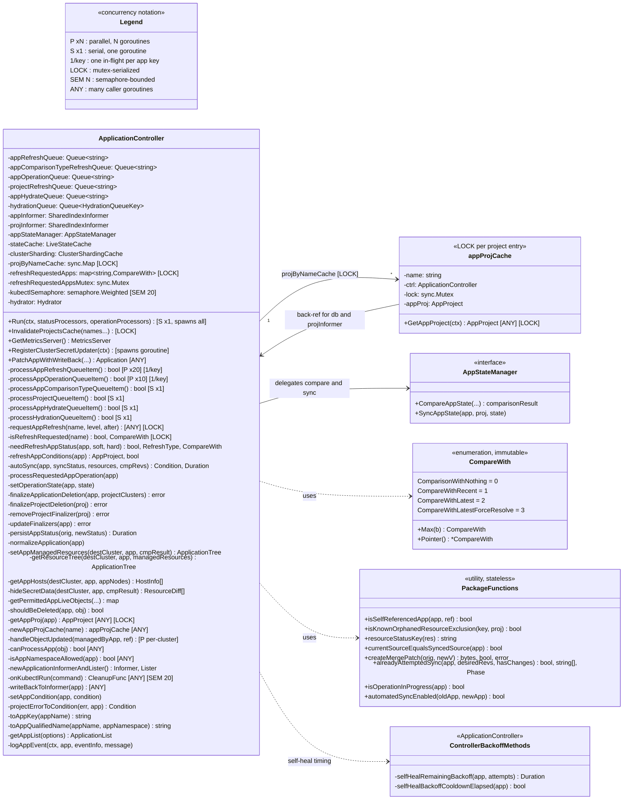

# 1. Structure — UML class diagram

Types declared in `controller/appcontroller.go` and their methods. `AppStateManager`
is declared elsewhere (`controller/state.go`) but shown because the controller
delegates all compare and sync work to it.

Concurrency markers follow the legend in `README.md`. Only **goroutine entry
points** and **serialization primitives** are marked; an unmarked method inherits
the concurrency of whichever caller reached it.

## Notes

- `appProjCache` holds a back-pointer to the controller so a cache miss can reach
  `projInformer` and `db`. That makes the relationship genuinely bidirectional.
- `hydrator` being nil is the feature flag. Every hydration path checks
  `ctrl.hydrator != nil` before touching it.
- `deploymentInformer` is only non-nil when `dynamicClusterDistributionEnabled` is
  set, which is why each use is guarded.

## Concurrency classes

Six worker methods are goroutine entry points, spawned in `Run` (lines 929-962).
Everything else is reached *from* one of them, from an informer handler, or from a
live-state-cache callback.

| Method | Goroutines | Source |
|---|---|---|
| `processAppRefreshQueueItem` | `statusProcessors`, default **20** | `for i := 0; i < statusProcessors; i++` |
| `processAppOperationQueueItem` | `operationProcessors`, default **10** | `for i := 0; i < operationProcessors; i++` |
| `processAppComparisonTypeQueueItem` | **1** | single `go wait.Until` |
| `processProjectQueueItem` | **1** | single `go wait.Until` |
| `processAppHydrateQueueItem` | **1**, only if `hydrator != nil` | single `go wait.Until` |
| `processHydrationQueueItem` | **1**, only if `hydrator != nil` | single `go wait.Until` |

Non-worker entry points, which is where the surprises live:

| Entry point | Goroutine model |
|---|---|
| informer `AddFunc` / `UpdateFunc` / `DeleteFunc` | One `ResourceEventHandlerFuncs` is registered per informer, so client-go drives all three from a **single** listener goroutine. The three are serialized against each other. `appInformer`'s handler and `projInformer`'s handler are separate goroutines. |
| `NamespaceIndex` / `orphanedIndex` indexers | Run inside the informer's own `HandleDeltas` loop — a different goroutine from the handlers above. This is why their `setAppCondition` side effect is easy to miss. |
| `handleObjectUpdated` | Invoked from `clusterCache.OnResourceUpdated` in `controller/cache/cache.go:620`, registered **per managed cluster**. Concurrent across clusters. |
| `readinessHealthCheck` | HTTP handler on the metrics server. Any number of concurrent probes, and under dynamic distribution it can re-enqueue every app. |
| `Run` itself | The caller's goroutine. Spawns everything, then blocks on `<-ctx.Done()`. |

### Serialization primitives

Three, and they are the only mutable state shared across workers:

| Primitive | Protects | Held during |
|---|---|---|
| `refreshRequestedAppsMutex` (`sync.Mutex`) | `refreshRequestedApps` map | A map read/write only. Never held across I/O. |
| `projByNameCache` (`sync.Map`) | project cache entries | Lock-free reads. |
| `appProjCache.lock` (`sync.Mutex`, one per project) | that entry's `appProj` | **Held across a `projInformer` + `db` fetch.** Concurrent refresh workers wanting the same project queue behind one fetch rather than stampeding. |
| `kubectlSemaphore` (`semaphore.Weighted`) | fork/exec count | Acquired in `onKubectlRun`, released by the returned cleanup func. Bounds kubectl execs across *all* operation workers at once, default 20. Nil when the limit is < 1, which removes the bound. |

`appProjCache.lock` is the only one held across I/O, so it is the only one that can
show up as latency rather than just contention.
