# 2. Startup and dispatch

How `NewApplicationController` wires collaborators, and how `Run` spawns the six
worker loops.

Solid arrow = direct call. Dashed arrow = function value handed to another
component, invoked later by that component.

```mermaid
flowchart TD
    NEW["NewApplicationController"]
    NAIL["newApplicationInformerAndLister"]
    RHC["readinessHealthCheck<br/>closure"]
    PIH["projInformer<br/>Add/Update/DeleteFunc"]
    IPC["InvalidateProjectsCache"]
    OKR["onKubectlRun"]
    CPA["canProcessApp"]
    HOU["handleObjectUpdated"]
    RUN["Run"]
    RCSU["RegisterClusterSecretUpdater"]
    GAL["getAppList"]
    IANA["isAppNamespaceAllowed"]
    GAP["getAppProj"]

    NEW --> NAIL
    NEW --> PIH
    NEW --> RHC
    PIH --> IPC
    RHC --> CPA
    NEW -.->|"kubectl.SetOnKubectlRun"| OKR
    NEW -.->|"metrics.NewMetricsServer"| CPA
    NEW -.->|"statecache.NewLiveStateCache"| HOU
    NEW -.->|"NewAppStateManager"| OKR

    RUN --> RCSU
    RUN --> GAL
    GAL --> IANA
    RCSU -.->|"NewClusterInfoUpdater"| GAP

    RUN --> W1["processAppRefreshQueueItem<br/>x statusProcessors"]
    RUN --> W2["processAppOperationQueueItem<br/>x operationProcessors"]
    RUN --> W3["processAppComparisonTypeQueueItem<br/>x1"]
    RUN --> W4["processProjectQueueItem<br/>x1"]
    RUN --> W5["processAppHydrateQueueItem<br/>x1, if hydrator"]
    RUN --> W6["processHydrationQueueItem<br/>x1, if hydrator"]

    style NEW fill:#e8f0fe
    style RUN fill:#e8f0fe
```



## What `Run` does before starting workers

```
RegisterClusterSecretUpdater(ctx)
metricsServer.RegisterClustersInfoSource(...)
[deploymentInformer.Informer().Run]        only if dynamic distribution
db.ListClusters + getAppList → clusterSharding.Init(clusters, appItems)
appInformer.Run + projInformer.Run         goroutines
stateCache.Init()
cache.WaitForCacheSync(appInformer, projInformer)   blocks
stateCache.Run(ctx)                        goroutine
metricsServer.ListenAndServe()             goroutine
→ spawn the six worker loops
<-ctx.Done()
```

Each worker is wrapped in `wait.Until(fn, time.Second, ctx.Done())`, so a worker
that returns is restarted after one second. Workers return `processNext = false`
only on queue shutdown, which is what ends the `wait.Until` loop cleanly.

## The readiness check is not just a health check

`readinessHealthCheck` is registered as an HTTP handler on the metrics server, but
under `dynamicClusterDistributionEnabled` it also:

1. reads the controller Deployment's replica count,
2. recomputes this pod's shard via `sharding.GetOrUpdateShardFromConfigMap`,
3. and if the shard changed, calls `stateCache.UpdateShard` and re-enqueues every
   app that passes `canProcessApp`.

So an HTTP probe can trigger a full resync. Worth knowing when reading logs.
