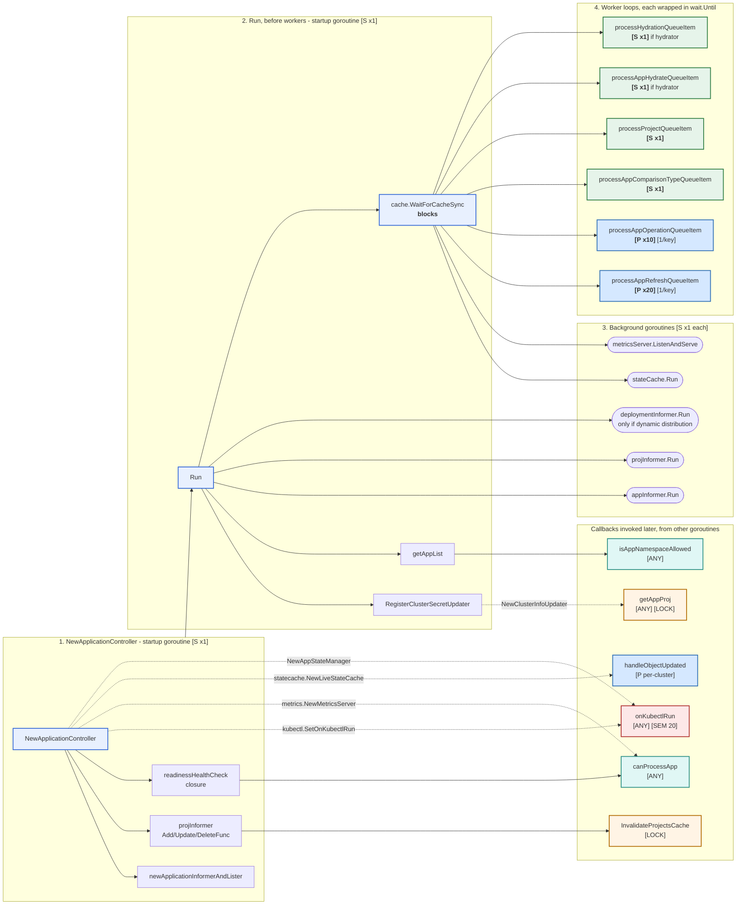

# 2. Startup and dispatch

How `NewApplicationController` wires collaborators, and how `Run` spawns the six
worker loops.

Solid arrow = direct call. Dashed arrow = function value handed to another
component, invoked later by that component.

Boxes are grouped by **owning goroutine**. Everything in the two grey lanes runs
sequentially on the process's startup goroutine; everything below runs
concurrently once `Run` reaches its worker loops. Marker legend is in `README.md`.



## What `Run` does before starting workers

Strictly sequential on one goroutine. `WaitForCacheSync` is the barrier: nothing
below it can run until both informers have synced.

```
RegisterClusterSecretUpdater(ctx)
metricsServer.RegisterClustersInfoSource(...)
[deploymentInformer.Informer().Run]        goroutine, only if dynamic distribution
db.ListClusters + getAppList -> clusterSharding.Init(clusters, appItems)
appInformer.Run + projInformer.Run         goroutines
stateCache.Init()
cache.WaitForCacheSync(appInformer, projInformer)   BLOCKS
stateCache.Run(ctx)                        goroutine
metricsServer.ListenAndServe()             goroutine
-> spawn the six worker loops              goroutines
<-ctx.Done()
```

## Worker fan-out

Lines 929-962. Two loops and four singletons:

```go
for i := 0; i < statusProcessors; i++ {        // default 20
    go wait.Until(func() {
        for ctrl.processAppRefreshQueueItem() {
        }
    }, time.Second, ctx.Done())
}

for i := 0; i < operationProcessors; i++ {     // default 10
    go wait.Until(func() {
        for ctrl.processAppOperationQueueItem() {
        }
    }, time.Second, ctx.Done())
}

go wait.Until(func() { for ctrl.processAppComparisonTypeQueueItem() {} }, ...)
go wait.Until(func() { for ctrl.processProjectQueueItem() {} }, ...)
if ctrl.hydrator != nil {
    go wait.Until(func() { for ctrl.processAppHydrateQueueItem() {} }, ...)
    go wait.Until(func() { for ctrl.processHydrationQueueItem() {} }, ...)
}
```

Default topology is **30 app-processing goroutines plus 2-4 singletons**.

Each worker is wrapped in `wait.Until(fn, time.Second, ctx.Done())`, so a worker
that returns is restarted after one second. Workers return `processNext = false`
only on queue shutdown, which is what ends the `wait.Until` loop cleanly. The inner
`for` loop means a healthy worker never returns at all — it drains its queue
forever, and `wait.Until` is only a crash net.

### Why four of them are singletons

| Worker | Why one is enough |
|---|---|
| `processAppComparisonTypeQueueItem` | Parses a level out of a queue key and re-enqueues. Pure string work, no I/O. |
| `processProjectQueueItem` | Only does work when a project has both a deletion timestamp and a finalizer. Almost always a no-op. |
| `processAppHydrateQueueItem` | Delegates straight to the hydrator. |
| `processHydrationQueueItem` | Hydration is keyed by *repo + target branch*, not by app, so many apps collapse onto one key. Parallelism here would mostly mean contending on the same branch. |

Scaling any of these means editing `Run` — none is configurable.

## Per-key serialization, and the gap in it

Inside one queue, client-go's workqueue guarantees at most one in-flight execution
per key: an item currently being processed is held in a `processing` set, and a
concurrent `Add` marks it dirty and defers re-adding until `Done`. So the 20 refresh
workers parallelize across *different* apps and never race on the same one.

That guarantee is **per queue**. `appRefreshQueue` and `appOperationQueue` have
independent `processing` sets, so one app can be inside a refresh worker and an
operation worker simultaneously. Both mitigations for that live in the workers
themselves, not here: see diagram 04 and 06.

## The readiness check is not just a health check

`readinessHealthCheck` is registered as an HTTP handler on the metrics server, so it
runs on **HTTP handler goroutines** — any number, concurrently, driven by kubelet
probes rather than by anything in `Run`. Under
`dynamicClusterDistributionEnabled` it also:

1. reads the controller Deployment's replica count,
2. recomputes this pod's shard via `sharding.GetOrUpdateShardFromConfigMap`,
3. and if the shard changed, calls `stateCache.UpdateShard` and re-enqueues every
   app that passes `canProcessApp`.

So an HTTP probe can trigger a full resync from a goroutine that owns none of the
queues. Worth knowing when reading logs.
