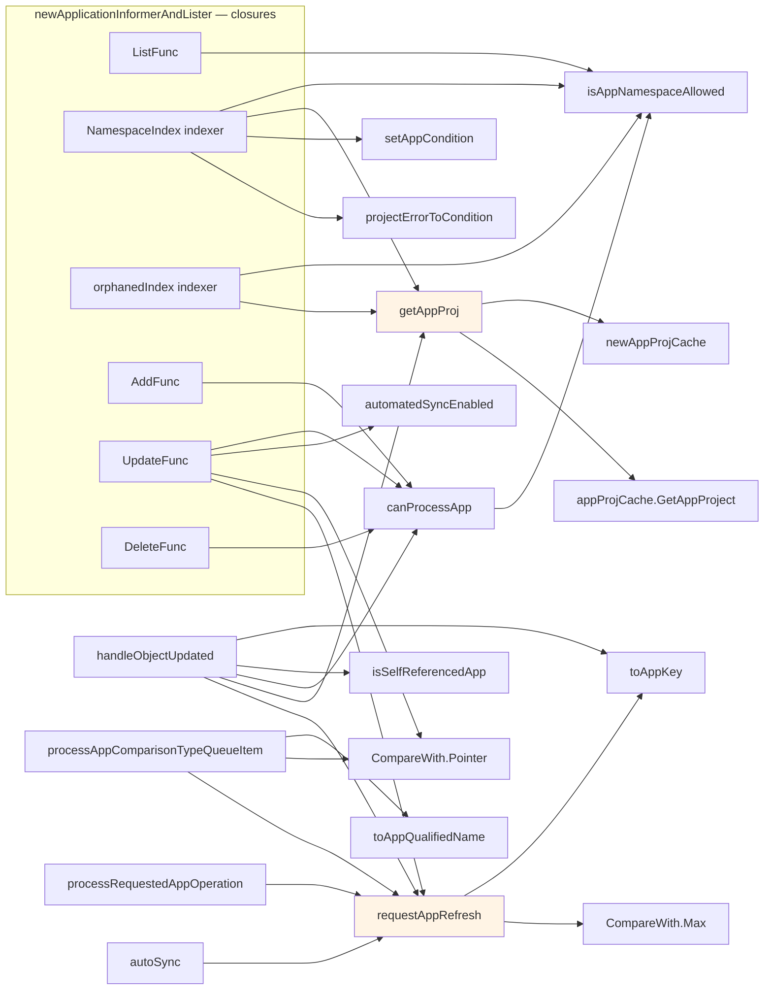

# 3. Trigger sources and `requestAppRefresh` fan-in

Everything that can put an Application onto a queue, and the shared helpers those
paths funnel through.



## Comparison level ladder

```
CompareWithLatestForceResolve = 3   latest git, bypass resolved-revision cache
CompareWithLatest             = 2   latest git
CompareWithRecent             = 1   revision from the most recent comparison
ComparisonWithNothing         = 0   skip compare, refresh resource tree only
```

`CompareWith.Max` means concurrent requests for the same app keep the strongest
level rather than the last one to arrive.

## The two-queue indirection for delayed refreshes

`requestAppRefresh(name, compareWith, after)` branches:

| `compareWith` | `after` | Destination |
|---|---|---|
| set | set | `appComparisonTypeRefreshQueue.AddAfter("ns/name/level", after)` |
| set | nil | level into `refreshRequestedApps` map, key into `appRefreshQueue.AddRateLimited` |
| nil | set | `appRefreshQueue.AddAfter(key, after)` |
| nil | nil | `appRefreshQueue.AddRateLimited(key)` |

The first row exists because the queue is `Queue[string]` and cannot carry a
struct. The level is encoded into the key, and
`processAppComparisonTypeQueueItem` parses it back out and re-calls
`requestAppRefresh` without a delay. That is the only reason that queue and worker
exist.

## Notable handler behaviors

- **`UpdateFunc`** applies `statusRefreshJitter` only when
  `oldApp.ResourceVersion == newApp.ResourceVersion`, i.e. only for informer
  resyncs, not real user edits. It also pushes onto `appOperationQueue` when a
  jitter delay was applied, and onto `appHydrateQueue` whenever the hydrator is on.
- **`DeleteFunc`** uses `Add`, not `AddRateLimited`, so deletions skip the rate
  limiter.
- **`NamespaceIndex` indexer has side effects.** It calls `setAppCondition` when the
  project or destination cluster is invalid. An indexer mutating cluster state is
  unusual; be aware of it when tracing where a condition came from.
- **`handleObjectUpdated`** skips the refresh when the changed object *is* the
  Application itself (`isSelfReferencedApp`), which prevents an infinite
  reconciliation loop. Managed resources get `CompareWithRecent`; orphans get
  `ComparisonWithNothing`.
