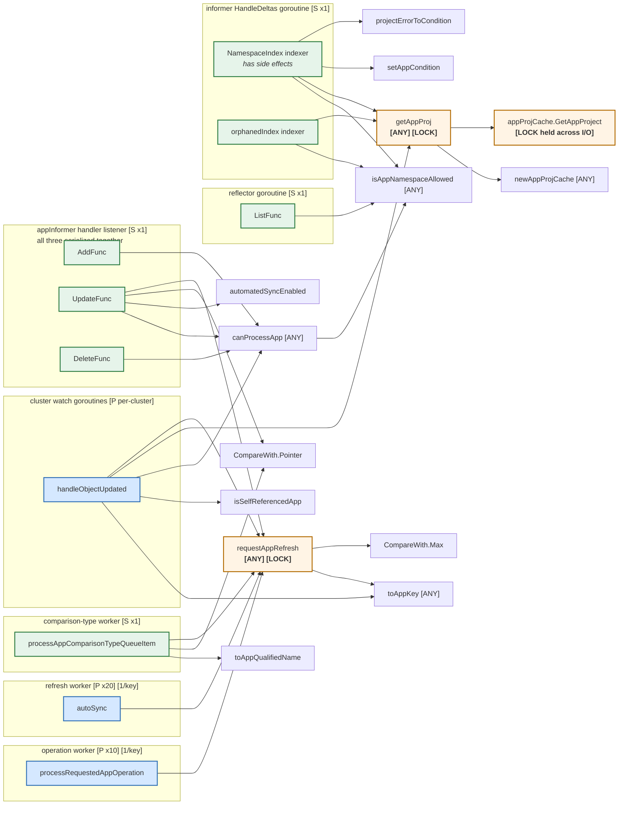

# 3. Trigger sources and `requestAppRefresh` fan-in

Everything that can put an Application onto a queue, and the shared helpers those
paths funnel through.

The `newApplicationInformerAndLister` closures do **not** all share a goroutine, so
they are split into three lanes below by actual owner. Marker legend is in
`README.md`.



## Who calls `requestAppRefresh`, and from where

It is the single most concurrently-entered method in the file. Six call sites
spanning five different goroutine classes:

| Caller | Goroutine | Concurrency |
|---|---|---|
| informer `UpdateFunc` | appInformer handler listener | `[S x1]` |
| `handleObjectUpdated` | cluster watch | `[P per-cluster]` |
| `processAppComparisonTypeQueueItem` | comparison-type worker | `[S x1]` |
| `processRequestedAppOperation` (2 sites) | operation worker | `[P x10]` |
| `autoSync` | refresh worker | `[P x20]` |

Hence the mutex. The critical section is tiny — a single map read-modify-write,
never held across I/O:

```go
ctrl.refreshRequestedAppsMutex.Lock()
// combine level, so we don't lose it if the app is already in the queue
ctrl.refreshRequestedApps[key] = compareWith.Max(ctrl.refreshRequestedApps[key])
ctrl.refreshRequestedAppsMutex.Unlock()
```

`isRefreshRequested` takes the same lock and **deletes** the entry as it reads, so
the request is consumed exactly once even with 20 refresh workers running.

## Comparison level ladder

```
CompareWithLatestForceResolve = 3   latest git, bypass resolved-revision cache
CompareWithLatest             = 2   latest git
CompareWithRecent             = 1   revision from the most recent comparison
ComparisonWithNothing         = 0   skip compare, refresh resource tree only
```

`CompareWith.Max` is what makes the lock worth having: concurrent requests for the
same app keep the strongest level rather than the last one to arrive. Without it, a
`ComparisonWithNothing` tree refresh arriving from a cluster watch goroutine could
downgrade a pending `CompareWithLatestForceResolve` from a user.

## The two-queue indirection for delayed refreshes

`requestAppRefresh(name, compareWith, after)` branches:

| `compareWith` | `after` | Destination |
|---|---|---|
| set | set | `appComparisonTypeRefreshQueue.AddAfter("ns/name/level", after)` |
| set | nil | level into `refreshRequestedApps` map `[LOCK]`, key into `appRefreshQueue.AddRateLimited` |
| nil | set | `appRefreshQueue.AddAfter(key, after)` |
| nil | nil | `appRefreshQueue.AddRateLimited(key)` |

The first row exists because the queue is `Queue[string]` and cannot carry a
struct. The level is encoded into the key, and
`processAppComparisonTypeQueueItem` parses it back out and re-calls
`requestAppRefresh` without a delay. That is the only reason that queue and worker
exist — and why one goroutine suffices for it.

## `getAppProj` and the only lock held across I/O

`getAppProj` is reached from nine sites across every goroutine class in the file, so
it is `[ANY]`. The interesting part is one level down:

```go
type appProjCache struct {
    name string
    ctrl *ApplicationController
    lock    sync.Mutex
    appProj *appv1.AppProject
}
```

`projByNameCache` is a `sync.Map`, so *finding* the entry is lock-free. But
`GetAppProject` holds that entry's mutex across a `projInformer` lookup and a
possible `db` call. This is deliberate: on a cold cache, 20 refresh workers all
reconciling apps in the same project queue behind a single fetch instead of
stampeding the API server. It also means this mutex is the one place in the
controller where lock contention shows up as latency rather than just CPU.

## Notable handler behaviors

- **All three informer handlers share one goroutine.** `AddFunc`, `UpdateFunc`, and
  `DeleteFunc` are fields of a single `ResourceEventHandlerFuncs` passed to one
  `AddEventHandler` call, and client-go drives each registered handler from its own
  single `processorListener` goroutine. They are therefore serialized against each
  other, and none of them can be re-entered. `projInformer`'s handler is a separate
  goroutine, so `InvalidateProjectsCache` *can* run concurrently with the app
  handlers.
- **The indexers run on a different goroutine from the handlers.** `NamespaceIndex`
  and `orphanedIndex` are invoked from the informer's `HandleDeltas` path, upstream
  of the handler listeners.
- **`NamespaceIndex` has side effects.** It calls `setAppCondition` when the project
  or destination cluster is invalid. An indexer mutating cluster state is unusual,
  and because it runs on the delta goroutine rather than a worker, a condition can
  appear with no reconcile in the logs to explain it.
- **`UpdateFunc`** applies `statusRefreshJitter` only when
  `oldApp.ResourceVersion == newApp.ResourceVersion`, i.e. only for informer
  resyncs, not real user edits. It also pushes onto `appOperationQueue` when a
  jitter delay was applied, and onto `appHydrateQueue` whenever the hydrator is on.
- **`DeleteFunc`** uses `Add`, not `AddRateLimited`, so deletions skip the rate
  limiter.
- **`handleObjectUpdated`** skips the refresh when the changed object *is* the
  Application itself (`isSelfReferencedApp`), which prevents an infinite
  reconciliation loop. Managed resources get `CompareWithRecent`; orphans get
  `ComparisonWithNothing`. This is the only trigger source that scales with cluster
  count rather than app count.
