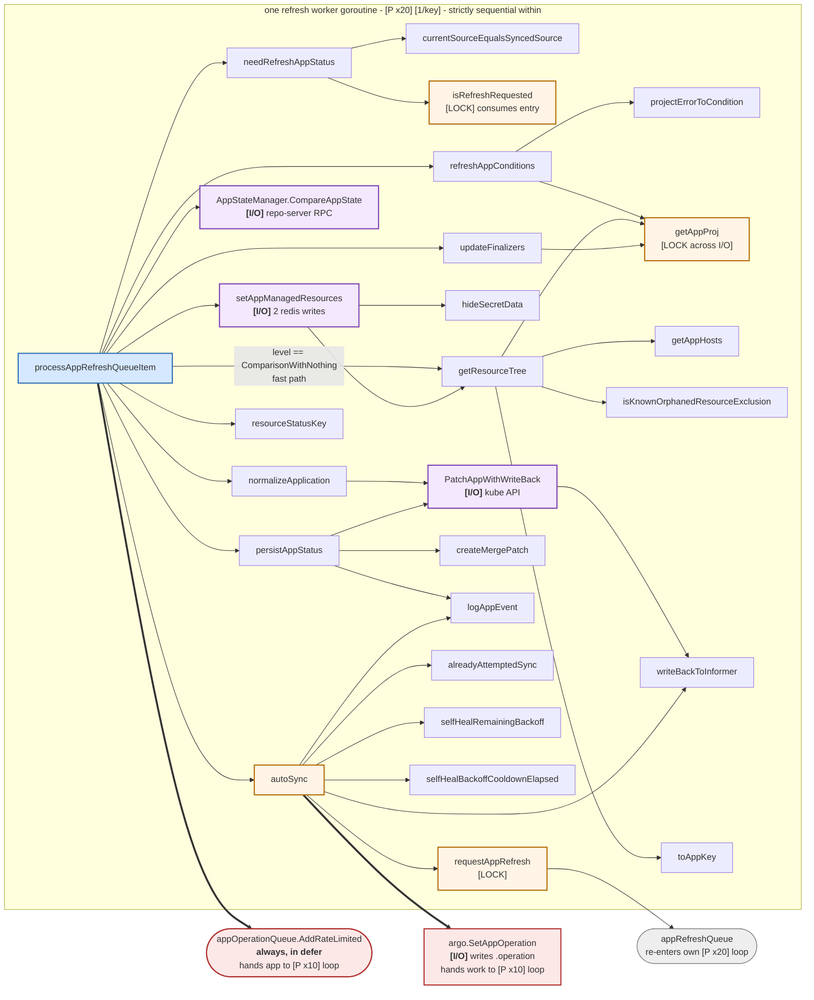

# 4. Refresh loop call graph

`processAppRefreshQueueItem` — the status reconciliation path. Run by
`statusProcessors` parallel workers, default **20**.

Read this diagram as **one goroutine's sequential execution**. Everything inside the
outer lane happens in order, on a single worker, for a single app. The parallelism
is entirely *across* apps: 20 copies of this whole tree run at once on 20 different
Applications, and the workqueue guarantees no two of them are ever the same app.

The nodes worth singling out are the ones that leave the goroutine — the red ones —
and the ones that block it on something external, marked `[I/O]`. Marker legend is
in `README.md`.



## Ordered flow

```
Get() from appRefreshQueue                 blocks until an item is available
defer: recover() -> appOperationQueue.AddRateLimited(appKey) -> appRefreshQueue.Done()
indexer lookup by key                      not found -> return (already deleted)
origApp.DeepCopy() twice                   origApp for diff base, app for mutation
needRefreshAppStatus()                     false -> return
  |
[fast path] level == ComparisonWithNothing
    GetDestinationCluster
    cache.GetAppManagedResources            miss -> fall through to full path
    getResourceTree -> cache.SetAppResourcesTree
    persistAppStatus -> return
  |
refreshAppConditions()                     errors -> Sync/Health Unknown,
                                            wipe cached tree, persist, return
GetDestinationCluster()
build revisions[] and sources[]             multi-source aware
AppStateManager.CompareAppState(...)        repo-server manifest gen + diff  <- longest hold
    ErrCompareStateRepo -> warn + return     transient git error, do not clobber
normalizeApplication()                      may patch spec
setAppManagedResources()                    hideSecretData + getResourceTree + 2 cache writes
SyncWindows.Matches(app).CanSync(false)
    allowed -> autoSync(...)
    blocked -> log "Sync prevented by sync window"
write compareResult into app.Status         Sync, Health, Resources (sorted), SourceType
persistAppStatus()
reconcile post-delete finalizers            if hasPostDeleteHooks changed
```

## What holds a worker slot

With 20 workers, every blocking call below occupies 1/20th of the controller's
status-reconciliation capacity for its duration. This is the list to look at when
`Reconciliation completed` gets slow, and it is why the timing checkpoints exist.

| Call | Blocks on | Timing field |
|---|---|---|
| `appRefreshQueue.Get()` | nothing — idle wait, not a hold | — |
| `CompareAppState` | repo-server gRPC: manifest generation, then diff | `compare_app_state_ms` |
| `getAppProj` -> `GetAppProject` | `projInformer` (memory), possibly `db` — **and the per-project mutex** | inside `refresh_app_conditions_ms` |
| `setAppManagedResources` | two Redis writes plus tree building | `set_app_managed_resources_ms` |
| `PatchAppWithWriteBack` | Kubernetes API patch | `patch_ms` |
| `SetAppOperation` (in `autoSync`) | Kubernetes API update | `setop_ms` |

`CompareAppState` dominates in practice. Nothing in this path holds a lock while
waiting on it, so a slow repo-server costs throughput but does not cause contention.
The one exception is `getAppProj`: `appProjCache.lock` *is* held across its fetch, so
on a cold cache many workers reconciling apps in the same project serialize there
deliberately, rather than stampeding the API server.

## The unconditional handoff

The `defer` is registered at line 1645, **before** the indexer lookup and before
`needRefreshAppStatus`:

```go
defer func() {
    if r := recover(); r != nil {
        log.Errorf("Recovered from panic: %+v\n%s", r, debug.Stack())
    }
    // We want to have app operation update happen after the sync, so there's no race condition
    // and app updates not proceeding. See https://github.com/argoproj/argo-cd/issues/18500.
    ctrl.appOperationQueue.AddRateLimited(appKey)
    ctrl.appRefreshQueue.Done(appKey)
}()
```

So **every** exit path — status already fresh, project unresolvable, panic, app
already deleted — still hands the key to the operation loop. The design bets that
`processAppOperationQueueItem` is cheap when there is nothing to do (one indexer
lookup, one nil check) and that unconditional chaining is safer than predicting when
an operation is pending.

Note the ordering: `AddRateLimited` on the *other* queue happens before `Done` on
*this* one. Since the two queues track keys independently, the app can be picked up
by an operation worker before this refresh worker has finished returning.

## `needRefreshAppStatus` — the throttle

Returns true only for one of these reasons, and the reason picks the level:

| Reason | Level | Refresh type |
|---|---|---|
| `app.IsRefreshRequested()` annotation | `CompareWithLatestForceResolve` | as requested (may be Hard) |
| `spec.source` / `spec.sources` differs | `CompareWithLatestForceResolve` | Normal |
| hard expiry of `ReconciledAt` | `CompareWithLatest` | **Hard** |
| soft expiry of `ReconciledAt` | `CompareWithLatest` | Normal |
| `spec.destination` differs | `CompareWithLatest` | Normal |
| `managedNamespaceMetadata` changed | `CompareWithLatest` | Normal |
| `spec.ignoreDifferences` differs | `CompareWithLatest` | Normal |
| pending internal request (`isRefreshRequested`) | level from map | Normal |

`isRefreshRequested` takes `refreshRequestedAppsMutex` and is destructive: it deletes
the map entry as it reads it. That is what makes the request exactly-once even though
20 workers and five other goroutine classes all touch that map.

## `autoSync` gauntlet

Early returns, in order:

```
SyncPolicy nil or automated disabled       -> nil, 0
app.Operation != nil                       -> "another operation is in progress"
DeletionTimestamp set                      -> "deletion in progress"
syncStatus != OutOfSync                    -> skip
prune disabled AND only prunes remain      -> skip
```

Then `alreadyAttemptedSync` decides:

| Outcome | Action |
|---|---|
| attempted, last phase **not** successful | return `SyncError` condition, do not retry |
| attempted, successful, self-heal **off** | skip |
| attempted, successful, self-heal **on** | enter backoff logic |
| not attempted | proceed to sync |

Backoff: `selfHealBackoffCooldownElapsed` decides whether `SelfHealAttemptsCount`
carries forward or resets. `selfHealRemainingBackoff` computes the wait (flat
`selfHealTimeout`, or N steps of the configured `wait.Backoff`). If time remains, it
schedules a delayed refresh and returns. Otherwise it increments the counter and
narrows `op.Sync.Resources` to only the out-of-sync resources.

Final guard: prune on + `allowEmpty` off + every resource requires pruning → refuse,
because that would wipe the app.

### The cross-queue race, seen from here

`autoSync` reads `app.Operation` from the informer copy and bails if it is non-nil.
That check can be stale, because nothing stops an operation worker from writing
`.operation` for this same app while this refresh worker is running. The real guard
is at the API server, and the error is swallowed on purpose:

```go
updatedApp, err := argo.SetAppOperation(appIf, app.Name, &op)
if err != nil {
    if stderrors.Is(err, argo.ErrAnotherOperationInProgress) {
        // skipping auto-sync because another operation is in progress and was not noticed due to stale data in informer
        // it is safe to skip auto-sync because it is already running
        logCtx.Warnf("Failed to initiate auto-sync to %s: %v", desiredRevisions, err)
        return nil, 0
    }
    ...
}
ctrl.writeBackToInformer(updatedApp)
```

`ErrAnotherOperationInProgress` is therefore an expected outcome under load, not a
fault. It is the informer-staleness mitigation for a race that per-key queue
serialization cannot cover.

## Persistence details

- `persistAppStatus` is the **only** place `Health.LastTransitionTime` is set. It
  also strips `AnnotationKeyRefresh` and `AnnotationKeyHydrate` from the patch so
  those requests are consumed.
- `PatchAppWithWriteBack` always pairs the API patch with `writeBackToInformer` so
  the next worker — possibly an operation worker already holding this key — does not
  read a stale app.
- `autoSync` calls `writeBackToInformer` directly after `SetAppOperation`, since
  that write does not go through `PatchAppWithWriteBack`.
