# 4. Refresh loop call graph

`processAppRefreshQueueItem` — the status reconciliation path. Run by
`statusProcessors` parallel workers.

```mermaid
flowchart TD
    PARQ["processAppRefreshQueueItem"]

    NRAS["needRefreshAppStatus"]
    CSESS["currentSourceEqualsSyncedSource"]
    IRR["isRefreshRequested"]
    GRT["getResourceTree"]
    PAS["persistAppStatus"]
    RAC["refreshAppConditions"]
    PETC["projectErrorToCondition"]
    GAP["getAppProj"]
    CAS["AppStateManager.CompareAppState"]
    NA["normalizeApplication"]
    SAMR["setAppManagedResources"]
    HSD["hideSecretData"]
    GAH["getAppHosts"]
    IKORE["isKnownOrphanedResourceExclusion"]
    AS["autoSync"]
    UFIN["updateFinalizers"]
    RSK["resourceStatusKey"]
    PAWWB["PatchAppWithWriteBack"]
    WBTI["writeBackToInformer"]
    CMP["createMergePatch"]
    LAE["logAppEvent"]
    TAK["toAppKey"]
    AAS["alreadyAttemptedSync"]
    SHRB["selfHealRemainingBackoff"]
    SHBCE["selfHealBackoffCooldownElapsed"]
    RAR["requestAppRefresh"]
    OPQ(["appOperationQueue.AddRateLimited<br/>always, in defer"])
    SAO(["argo.SetAppOperation<br/>writes .operation"])

    PARQ --> NRAS
    NRAS --> CSESS
    NRAS --> IRR
    PARQ -->|"level == ComparisonWithNothing<br/>fast path"| GRT
    PARQ --> RAC
    RAC --> GAP
    RAC --> PETC
    PARQ --> CAS
    PARQ --> NA
    PARQ --> SAMR
    PARQ --> AS
    PARQ --> PAS
    PARQ --> UFIN
    PARQ --> RSK
    PARQ --> OPQ

    SAMR --> HSD
    SAMR --> GRT
    GRT --> GAP
    GRT --> TAK
    GRT --> IKORE
    GRT --> GAH

    NA --> PAWWB
    PAS --> CMP
    PAS --> LAE
    PAS --> PAWWB
    UFIN --> GAP
    PAWWB --> WBTI

    AS --> AAS
    AS --> SHBCE
    AS --> SHRB
    AS --> RAR
    AS --> WBTI
    AS --> LAE
    AS --> SAO

    style PARQ fill:#e8f0fe
    style AS fill:#fff4e5
    style OPQ fill:#fde8e8
```



## Ordered flow

```
Get() from appRefreshQueue
defer: recover() → appOperationQueue.AddRateLimited(appKey) → appRefreshQueue.Done()
indexer lookup by key                      not found → return (already deleted)
origApp.DeepCopy() twice                   origApp for diff base, app for mutation
needRefreshAppStatus()                     false → return
  ↓
[fast path] level == ComparisonWithNothing
    GetDestinationCluster
    cache.GetAppManagedResources            miss → fall through to full path
    getResourceTree → cache.SetAppResourcesTree
    persistAppStatus → return
  ↓
refreshAppConditions()                     errors → Sync/Health Unknown,
                                            wipe cached tree, persist, return
GetDestinationCluster()
build revisions[] and sources[]             multi-source aware
AppStateManager.CompareAppState(...)        repo-server manifest gen + diff
    ErrCompareStateRepo → warn + return     transient git error, do not clobber
normalizeApplication()                      may patch spec
setAppManagedResources()                    hideSecretData + getResourceTree + 2 cache writes
SyncWindows.Matches(app).CanSync(false)
    allowed → autoSync(...)
    blocked → log "Sync prevented by sync window"
write compareResult into app.Status         Sync, Health, Resources (sorted), SourceType
persistAppStatus()
reconcile post-delete finalizers            if hasPostDeleteHooks changed
```

## `needRefreshAppStatus` — the throttle

Returns true only for one of these reasons, and the reason picks the level:

| Reason | Level | Refresh type |
|---|---|---|
| `app.IsRefreshRequested()` annotation | `CompareWithLatestForceResolve` | as requested (may be Hard) |
| `spec.source` / `spec.sources` differs | `CompareWithLatestForceResolve` | Normal |
| hard expiry of `ReconciledAt` | `CompareWithLatest` | **Hard** |
| soft expiry of `ReconciledAt` | `CompareWithLatest` | Normal |
| `spec.destination` differs | `CompareWithLatest` | Normal |
| `managedNamespaceMetadata` changed | `CompareWithLatest` | Normal |
| `spec.ignoreDifferences` differs | `CompareWithLatest` | Normal |
| pending internal request (`isRefreshRequested`) | level from map | Normal |

`isRefreshRequested` is destructive: it deletes the map entry as it reads it, so the
request is consumed exactly once.

## `autoSync` gauntlet

Early returns, in order:

```
SyncPolicy nil or automated disabled       → nil, 0
app.Operation != nil                       → "another operation is in progress"
DeletionTimestamp set                      → "deletion in progress"
syncStatus != OutOfSync                    → skip
prune disabled AND only prunes remain      → skip
```

Then `alreadyAttemptedSync` decides:

| Outcome | Action |
|---|---|
| attempted, last phase **not** successful | return `SyncError` condition, do not retry |
| attempted, successful, self-heal **off** | skip |
| attempted, successful, self-heal **on** | enter backoff logic |
| not attempted | proceed to sync |

Backoff: `selfHealBackoffCooldownElapsed` decides whether `SelfHealAttemptsCount`
carries forward or resets. `selfHealRemainingBackoff` computes the wait (flat
`selfHealTimeout`, or N steps of the configured `wait.Backoff`). If time remains, it
schedules a delayed refresh and returns. Otherwise it increments the counter and
narrows `op.Sync.Resources` to only the out-of-sync resources.

Final guard: prune on + `allowEmpty` off + every resource requires pruning → refuse,
because that would wipe the app.

## Persistence details

- `persistAppStatus` is the **only** place `Health.LastTransitionTime` is set. It
  also strips `AnnotationKeyRefresh` and `AnnotationKeyHydrate` from the patch so
  those requests are consumed.
- `PatchAppWithWriteBack` always pairs the API patch with `writeBackToInformer` so
  the next worker does not read a stale app.
- `autoSync` calls `writeBackToInformer` directly after `SetAppOperation`, since
  that write does not go through `PatchAppWithWriteBack`.
