# 5. Operation, project, and hydration loops

```mermaid
flowchart TD
    PAOQ["processAppOperationQueueItem"]
    PRAO["processRequestedAppOperation"]
    FAD["finalizeApplicationDeletion"]
    SOS["setOperationState"]
    IOIP["isOperationInProgress"]
    SAS["AppStateManager.SyncAppState"]
    GAP["getAppProj"]
    TAK["toAppKey"]
    RAR["requestAppRefresh"]
    PAWWB["PatchAppWithWriteBack"]
    WBTI["writeBackToInformer"]
    LAE["logAppEvent"]
    SAC["setAppCondition"]
    GPALO["getPermittedAppLiveObjects"]
    SBD["shouldBeDeleted"]
    ISRA["isSelfReferencedApp"]
    UFIN["updateFinalizers"]
    EPDH(["executePostDeleteHooks<br/>hook.go"])
    CPDH(["cleanupPostDeleteHooks<br/>hook.go"])
    FOFD(["FilterObjectsForDeletion<br/>sort_delete.go"])
    NOS(["NewOperationState<br/>state.go"])
    PRQ(["projectRefreshQueue.Add"])

    PAOQ -->|".operation != nil"| PRAO
    PAOQ -->|"deletionTimestamp != nil"| FAD
    PAOQ --> SAC
    PAOQ --> LAE

    PRAO --> IOIP
    PRAO --> NOS
    PRAO --> SOS
    PRAO --> TAK
    PRAO --> GAP
    PRAO --> SAS
    PRAO --> RAR
    SOS --> PAWWB
    SOS --> LAE
    PAWWB --> WBTI

    FAD --> GAP
    FAD --> GPALO
    FAD --> SBD
    SBD --> ISRA
    FAD --> FOFD
    FAD --> EPDH
    FAD --> CPDH
    FAD --> UFIN
    FAD --> PRQ
    UFIN --> GAP

    PPQ["processProjectQueueItem"] --> FPD["finalizeProjectDeletion"]
    FPD --> RPF["removeProjectFinalizer"]
    PRQ -.->|"feeds"| PPQ

    PAHQ["processAppHydrateQueueItem"] --> H1(["hydrator.ProcessAppHydrateQueueItem"])
    PHQ["processHydrationQueueItem"] --> H2(["hydrator.ProcessHydrationQueueItem"])

    style PAOQ fill:#e8f0fe
    style PPQ fill:#e8f0fe
    style PAHQ fill:#e8f0fe
    style PHQ fill:#e8f0fe
```



## Operation loop

```
Get() from appOperationQueue → indexer lookup → DeepCopy
if app.Operation != nil:
    GET fresh from API server      deliberately bypasses the informer
    processRequestedAppOperation(app)
else if app.DeletionTimestamp != nil:
    finalizeApplicationDeletion(app, projectClusters)
      on error → setAppCondition(DeletionError) + warning event
```

The fresh GET matters because both the controller and the API server write to
Applications. Acting on a stale `.operation` could re-run a sync that was already
cancelled.

### `processRequestedAppOperation` state machine

If `isOperationInProgress(app)`:

| Condition | Action |
|---|---|
| Phase == `Terminating` | resume; sync code will clean up |
| `syncTimeout` exceeded | flip to `Terminating`, record `terminatingCause` |
| Phase == `Running` **and** `FinishedAt != nil` | the encoded "failed, awaiting retry" state — see below |
| default | resume |

The third row is the retry mechanism. A failed operation is stored as
`Phase = Running` with `FinishedAt` set — a combination that never occurs
naturally. On the next pass, `NextRetryAt` is computed; if it is in the future the
worker schedules a delayed refresh and returns, otherwise it clears `SyncResult`,
nulls `FinishedAt`, optionally blanks the revisions (when `Retry.Refresh`), and
proceeds. The encoding happens at the bottom of the same function in the
`OperationFailed, OperationError` branch.

Otherwise it is a brand new operation: `NewOperationState`, persist, and if
`syncTimeout` is set, self-schedule a timeout check via
`appOperationQueue.AddAfter`.

Then `AppStateManager.SyncAppState(app, project, state)` does the real work.

Post-sync:
- `Running` → re-GET the app; if it was marked `Terminating` meanwhile, do not
  clobber that.
- `Failed` / `Error` → encode the retry state if retries remain, else finalize the
  message with the retry count and terminating cause.

Finally, if the operation completed and was not a dry run, force a refresh:
`CompareWithLatest` for automated operations (avoids hammering ls-remote on
monorepos), `CompareWithLatestForceResolve` for user-initiated ones.

### `setOperationState` specifics

- Panics on an empty phase. Intentional bug-catcher.
- On completion, sets `operation: nil` in the patch to clear the pending operation.
- Uses a jsonpatch merge to force `finishedAt: null`, since a plain merge patch
  cannot clear a field.
- Wrapped in `kube.RetryUntilSucceed`, treating `IsNotFound` as success so a deleted
  app stops the retry loop.
- On completion, emits the sync event and both `IncSync` / `IncAppSyncDuration`
  metrics.

## Deletion finalizer sequence

`finalizeApplicationDeletion` handles one finalizer per pass, returning early each
time so progress resumes on the next queue item:

1. **Cascaded deletion** — `getPermittedAppLiveObjects` (filtered by
   `proj.IsLiveResourcePermitted`), then `shouldBeDeleted` (skips CRDs, the app
   itself, `SyncOptionDisableDeletion`, Helm `resource-policy: keep`). Returns and
   waits if any object already has a deletion timestamp, or if a resource needs
   `RequiresDeletionConfirmation` and confirmation is absent. Deletes in
   `FilterObjectsForDeletion` order with foreground or background propagation, then
   re-lists to confirm.
2. **post-delete hooks** → `executePostDeleteHooks`
3. **post-delete `cleanup`** → `cleanupPostDeleteHooks`
4. No finalizers left → clear cached tree and managed resources, then nudge
   `projectRefreshQueue` so a project blocked on this app can finish deleting.

If the destination cluster cannot be resolved at all, it strips every finalizer and
returns cleanly rather than blocking deletion forever.

## Project loop

Minimal by design. `processProjectQueueItem` only acts when the project has both a
deletion timestamp and a finalizer. `finalizeProjectDeletion` counts apps
referencing the project; zero means `removeProjectFinalizer` patches it off,
otherwise it logs and waits for a future trigger.

The project informer's other job is cache invalidation — all three of its handlers
call `InvalidateProjectsCache(name)` to clear `projByNameCache`.

## Hydration loops

Both are thin adapters. The logic lives in `controller/hydrator`, and the hydrator
calls back into the controller through the `hydrator.Dependencies` interface
implemented in `controller/hydrator_dependencies.go` — not in `appcontroller.go`.
