# 5. Operation, project, and hydration loops

The other four workers. One is parallel, three are singletons, and this is the only
diagram where the kubectl semaphore appears — the refresh loop never forks a process.

Each lane below is a separate goroutine class. Marker legend is in `README.md`.

```mermaid
flowchart TD
    subgraph opw["operation worker - [P x10] [1/key] - strictly sequential within"]
        PAOQ["processAppOperationQueueItem"]
        FRESH["GET fresh app from API<br/><b>[I/O]</b> bypasses informer"]
        PRAO["processRequestedAppOperation"]
        FAD["finalizeApplicationDeletion"]
        SOS["setOperationState<br/><b>[I/O]</b> RetryUntilSucceed"]
        IOIP["isOperationInProgress"]
        GAP["getAppProj<br/>[LOCK across I/O]"]
        TAK["toAppKey"]
        PAWWB["PatchAppWithWriteBack<br/><b>[I/O]</b> kube API"]
        WBTI["writeBackToInformer"]
        LAE["logAppEvent"]
        SAC["setAppCondition"]
        GPALO["getPermittedAppLiveObjects"]
        SBD["shouldBeDeleted"]
        ISRA["isSelfReferencedApp"]
        UFIN["updateFinalizers"]
        NOS(["NewOperationState<br/>state.go"])
    end

    subgraph synclane["reached from the operation worker, semaphore-bounded"]
        SAS["AppStateManager.SyncAppState<br/><b>[I/O]</b> manifest gen, apply, hook waits"]
        OKR["onKubectlRun<br/><b>[SEM 20]</b> across all 10 workers"]
        EPDH(["executePostDeleteHooks<br/>hook.go"])
        CPDH(["cleanupPostDeleteHooks<br/>hook.go"])
        FOFD(["FilterObjectsForDeletion<br/>sort_delete.go"])
    end

    subgraph projw["project worker - [S x1]"]
        PPQ["processProjectQueueItem"]
        FPD["finalizeProjectDeletion"]
        RPF["removeProjectFinalizer"]
    end

    subgraph hydw["hydrate worker - [S x1] if hydrator"]
        PAHQ["processAppHydrateQueueItem"]
        H1(["hydrator.ProcessAppHydrateQueueItem"])
    end

    subgraph hyd2["hydration worker - [S x1] if hydrator<br/>[1/key] keyed by repo+branch, not app"]
        PHQ["processHydrationQueueItem"]
        H2(["hydrator.ProcessHydrationQueueItem"])
    end

    RAR["requestAppRefresh<br/>[LOCK]<br/>hands app to [P x20] loop"]
    PRQ(["projectRefreshQueue.Add<br/>hands work to [S x1] loop"])

    PAOQ --> FRESH
    FRESH -->|".operation != nil"| PRAO
    PAOQ -->|"deletionTimestamp != nil"| FAD
    PAOQ --> SAC
    PAOQ --> LAE

    PRAO --> IOIP
    PRAO --> NOS
    PRAO --> SOS
    PRAO --> TAK
    PRAO --> GAP
    PRAO --> SAS
    PRAO ==> RAR
    SOS --> PAWWB
    SOS --> LAE
    PAWWB --> WBTI
    SAS --> OKR

    FAD --> GAP
    FAD --> GPALO
    FAD --> SBD
    SBD --> ISRA
    FAD --> FOFD
    FAD --> EPDH
    FAD --> CPDH
    FAD --> UFIN
    FAD ==> PRQ
    EPDH --> OKR
    CPDH --> OKR
    UFIN --> GAP

    PPQ --> FPD
    FPD --> RPF
    PRQ -.->|"feeds"| PPQ

    PAHQ --> H1
    PHQ --> H2

    classDef par fill:#d5e8ff,stroke:#2f6fb5,stroke-width:2px
    classDef ser fill:#e6f4ea,stroke:#2e7d43,stroke-width:2px
    classDef lock fill:#fff4e5,stroke:#b26a00,stroke-width:2px
    classDef sem fill:#fde8e8,stroke:#b03030,stroke-width:2px
    classDef handoff fill:#fde8e8,stroke:#b03030,stroke-width:2px
    classDef io fill:#f3e8fd,stroke:#7b3fb5,stroke-width:2px
    classDef q fill:#eeeeee,stroke:#777777

    class PAOQ par
    class PPQ ser
    class PAHQ ser
    class PHQ ser
    class GAP lock
    class RAR handoff
    class PRQ q
    class OKR sem
    class SAS io
    class SOS io
    class FRESH io
    class PAWWB io
```



## Concurrency of the four loops

| Worker | Goroutines | Queue key | Why |
|---|---|---|---|
| `processAppOperationQueueItem` | **10** (`operationProcessors`) | `ns/name` | Syncing is slow and per-app, so it parallelizes cleanly. |
| `processProjectQueueItem` | **1** | project name | Almost always a no-op; only acts when a project has both a deletion timestamp and a finalizer. |
| `processAppHydrateQueueItem` | **1** | `ns/name` | Thin adapter into the hydrator. |
| `processHydrationQueueItem` | **1** | `HydrationQueueKey` | **Not keyed by app.** Keyed by source repo + target revision + destination branch, so many apps collapse onto one key. Parallelism would mostly mean several workers contending on the same branch. |

## The kubectl semaphore

This is the only place a bound outside the worker counts applies. `onKubectlRun` is
handed to `NewAppStateManager` at construction and invoked by gitops-engine every
time it forks a `kubectl`:

```go
if kubectlParallelismLimit > 0 {
    ctrl.kubectlSemaphore = semaphore.NewWeighted(kubectlParallelismLimit)
}
kubectl.SetOnKubectlRun(ctrl.onKubectlRun)
```

```go
func (ctrl *ApplicationController) onKubectlRun(command string) (kube.CleanupFunc, error) {
    ctrl.metricsServer.IncKubectlExec(command)
    if ctrl.kubectlSemaphore != nil {
        if err := ctrl.kubectlSemaphore.Acquire(context.Background(), 1); err != nil {
            return nil, err
        }
        ...
    }
    return func() { /* Release(1) */ }, nil
}
```

Three consequences:

- The permit count (default **20**) is independent of the operation worker count
  (default **10**), so a single sync can hold several permits at once through
  parallel applies.
- `Acquire` uses `context.Background()`, so it is **uncancellable**. A worker
  blocked waiting for a permit stays blocked, and that wait is invisible in the
  operation worker's own timing checkpoints.
- Setting `--kubectl-parallelism-limit` below 1 leaves `kubectlSemaphore` nil and
  removes the bound entirely rather than setting it to zero.

Post-delete hooks reach the same semaphore, so cascaded deletions compete with
in-flight syncs for permits.

## Operation loop

```
Get() from appOperationQueue -> indexer lookup -> DeepCopy
if app.Operation != nil:
    GET fresh from API server      deliberately bypasses the informer
    processRequestedAppOperation(app)
else if app.DeletionTimestamp != nil:
    finalizeApplicationDeletion(app, projectClusters)
      on error -> setAppCondition(DeletionError) + warning event
```

The fresh GET is the primary mitigation for the cross-queue race. Per-key
serialization is per *queue*, so this same app may be inside a refresh worker right
now, and that worker may have just written `.operation` via `SetAppOperation` or
cleared it. Acting on the informer's copy could re-run a sync that was already
cancelled. Note `app.Operation != nil` is tested twice — once to decide whether to
re-GET, once to dispatch on the fresh copy.

### `processRequestedAppOperation` state machine

If `isOperationInProgress(app)`:

| Condition | Action |
|---|---|
| Phase == `Terminating` | resume; sync code will clean up |
| `syncTimeout` exceeded | flip to `Terminating`, record `terminatingCause` |
| Phase == `Running` **and** `FinishedAt != nil` | the encoded "failed, awaiting retry" state — see below |
| default | resume |

The third row is the retry mechanism. A failed operation is stored as
`Phase = Running` with `FinishedAt` set — a combination that never occurs
naturally. On the next pass, `NextRetryAt` is computed; if it is in the future the
worker schedules a delayed refresh and returns, otherwise it clears `SyncResult`,
nulls `FinishedAt`, optionally blanks the revisions (when `Retry.Refresh`), and
proceeds. The encoding happens at the bottom of the same function in the
`OperationFailed, OperationError` branch.

Because that state lives in the CRD rather than in worker memory, a retry survives a
controller restart, and the retry can be picked up by a *different* one of the 10
workers than the one that failed.

Otherwise it is a brand new operation: `NewOperationState`, persist, and if
`syncTimeout` is set, self-schedule a timeout check via
`appOperationQueue.AddAfter`. That self-schedule is why a stuck sync eventually gets
terminated even with no external trigger.

Then `AppStateManager.SyncAppState(app, project, state)` does the real work: this is
the longest hold in the controller, and the only one that forks processes.

Post-sync:
- `Running` → re-GET the app; if it was marked `Terminating` meanwhile, do not
  clobber that. A second informer-bypassing read, for the same reason as the first.
- `Failed` / `Error` → encode the retry state if retries remain, else finalize the
  message with the retry count and terminating cause.

Finally, if the operation completed and was not a dry run, force a refresh:
`CompareWithLatest` for automated operations (avoids hammering ls-remote on
monorepos), `CompareWithLatestForceResolve` for user-initiated ones.

### `setOperationState` specifics

- Panics on an empty phase. Intentional bug-catcher.
- On completion, sets `operation: nil` in the patch to clear the pending operation.
- Uses a jsonpatch merge to force `finishedAt: null`, since a plain merge patch
  cannot clear a field.
- Wrapped in `kube.RetryUntilSucceed`, treating `IsNotFound` as success so a deleted
  app stops the retry loop. This is a **blocking retry loop inside the worker** — it
  will hold one of the 10 slots until it succeeds or the app disappears.
- On completion, emits the sync event and both `IncSync` / `IncAppSyncDuration`
  metrics.

## Deletion finalizer sequence

`finalizeApplicationDeletion` handles one finalizer per pass, returning early each
time so progress resumes on the next queue item. That structure is what keeps a
long deletion from pinning an operation worker: each pass is short, and the app
comes back through the queue.

1. **Cascaded deletion** — `getPermittedAppLiveObjects` (filtered by
   `proj.IsLiveResourcePermitted`), then `shouldBeDeleted` (skips CRDs, the app
   itself, `SyncOptionDisableDeletion`, Helm `resource-policy: keep`). Returns and
   waits if any object already has a deletion timestamp, or if a resource needs
   `RequiresDeletionConfirmation` and confirmation is absent. Deletes in
   `FilterObjectsForDeletion` order with foreground or background propagation, then
   re-lists to confirm.
2. **post-delete hooks** → `executePostDeleteHooks`
3. **post-delete `cleanup`** → `cleanupPostDeleteHooks`
4. No finalizers left → clear cached tree and managed resources, then nudge
   `projectRefreshQueue` so a project blocked on this app can finish deleting.

If the destination cluster cannot be resolved at all, it strips every finalizer and
returns cleanly rather than blocking deletion forever.

Step 4 is the only cross-worker handoff here: a `[P x10]` worker enqueues onto the
`[S x1]` project loop.

## Project loop

Minimal by design, which is why one goroutine suffices. `processProjectQueueItem`
only acts when the project has both a deletion timestamp and a finalizer.
`finalizeProjectDeletion` counts apps referencing the project; zero means
`removeProjectFinalizer` patches it off, otherwise it logs and waits for a future
trigger — which normally arrives from step 4 above as the last app finishes deleting.

The project informer's other job is cache invalidation — all three of its handlers
call `InvalidateProjectsCache(name)` to clear `projByNameCache`. Those handlers run
on the projInformer listener goroutine, *not* on this worker, so a project cache
entry can be invalidated while refresh workers are mid-reconcile.

## Hydration loops

Both are thin adapters. The logic lives in `controller/hydrator`, and the hydrator
calls back into the controller through the `hydrator.Dependencies` interface
implemented in `controller/hydrator_dependencies.go` — not in `appcontroller.go`.
Both exist only when `ctrl.hydrator != nil`, so on a default install these two
goroutines are absent entirely.
