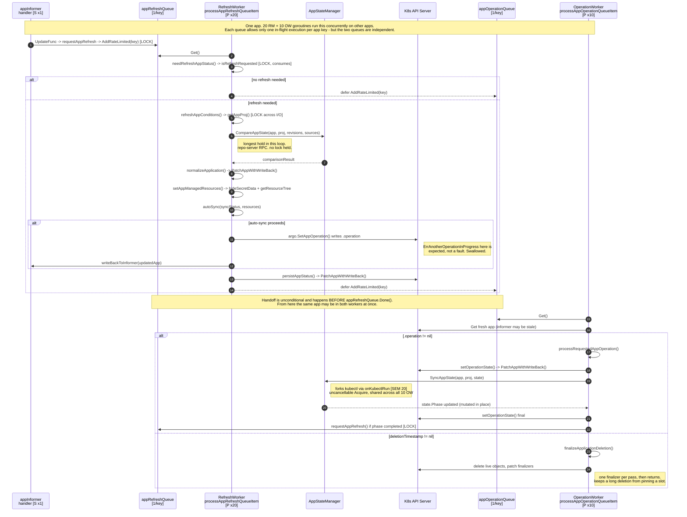

# 6. Sequence — one full reconcile across both loops

This traces **one Application**. On a default install, 20 refresh workers and 10
operation workers are each running this same sequence concurrently on *different*
apps. Marker legend is in `README.md`.



## The one thing to internalize

The controller never syncs directly. The refresh loop only ever **writes
`.operation` to the Application**; the operation loop picks that up later. A user
clicking Sync in the UI and `autoSync` deciding to sync converge on the same code
path from that point forward, which is why retries, timeouts, and termination behave
identically for both.

## Why the loops are split

Syncing is slow (manifest generation, kubectl apply, hook waits). If a single worker
handled both, a long sync would starve status reporting for every other app on the
shard. The split gives the two jobs independent, separately-tunable worker pools —
20 for status, 10 for sync — so a repo with slow manifest generation cannot consume
the capacity that keeps the UI current.

The chaining in the refresh loop's `defer` is deliberate and documented in the
source as a fix for
[argo-cd#18500](https://github.com/argoproj/argo-cd/issues/18500):

```go
defer func() {
    // We want to have app operation update happen after the sync, so there's no race
    // condition and app updates not proceeding.
    ctrl.appOperationQueue.AddRateLimited(appKey)
    ctrl.appRefreshQueue.Done(appKey)
}()
```

Note it runs unconditionally — even when `needRefreshAppStatus` returned false — so a
pending operation is never missed just because the status was already fresh.

## Where the two lanes overlap

The workqueue's per-key guarantee is **per queue**. `appRefreshQueue` and
`appOperationQueue` keep independent `processing` sets, so nothing prevents one
Application from being inside a refresh worker and an operation worker at the same
instant. The `defer` above even makes it likely: it adds to `appOperationQueue`
*before* calling `Done` on `appRefreshQueue`.

Every informer-staleness mitigation in the file exists to absorb that window:

| Mitigation | Where | Absorbs |
|---|---|---|
| Re-GET from the API server before acting | `processAppOperationQueueItem`, and again after `SyncAppState` returns `Running` | An `.operation` that the refresh worker wrote, cleared, or that a user cancelled. |
| `PatchAppWithWriteBack` pairs every patch with an informer write-back | all three callers | The other worker reading a pre-patch copy. |
| `ErrAnotherOperationInProgress` treated as benign | `autoSync` | `app.Operation` having been nil in the informer but non-nil at the API server. |
| Retry state encoded in the CRD, not worker memory | `processRequestedAppOperation` | A retry resuming on a different worker, or after a restart. |

Reading that table as a group is the fastest way to understand why the code re-reads
the same object so often. It is not defensive habit; each read closes a specific
window opened by the two-queue design.

### What is *not* protected

Two refresh workers can never process the same app (same queue, per-key guarantee).
Two operation workers can never process the same app. But a refresh worker and an
operation worker can, and no lock prevents it — the API server's optimistic
concurrency and the re-GETs are the entire defence. If you add a code path that
mutates an Application from one loop and assumes the other loop is idle, that
assumption is wrong.
