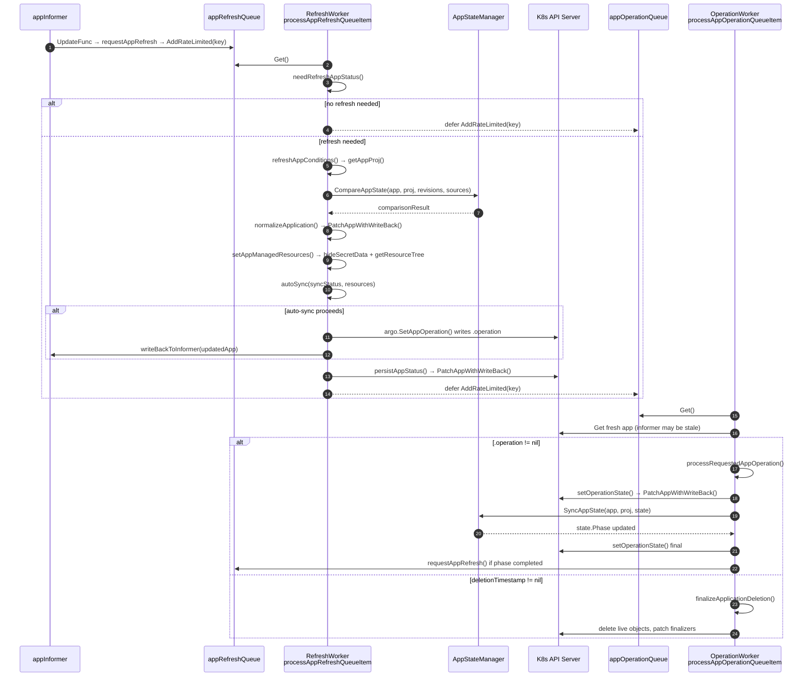

# 6. Sequence — one full reconcile across both loops



## The one thing to internalize

The controller never syncs directly. The refresh loop only ever **writes
`.operation` to the Application**; the operation loop picks that up later. A user
clicking Sync in the UI and `autoSync` deciding to sync converge on the same code
path from that point forward, which is why retries, timeouts, and termination behave
identically for both.

## Why the loops are split

Syncing is slow (manifest generation, kubectl apply, hook waits). If a single worker
handled both, a long sync would starve status reporting for every other app on the
shard. The chaining in the refresh loop's `defer` is deliberate and documented in
the source as a fix for
[argo-cd#18500](https://github.com/argoproj/argo-cd/issues/18500):

```go
defer func() {
    // We want to have app operation update happen after the sync, so there's no race
    // condition and app updates not proceeding.
    ctrl.appOperationQueue.AddRateLimited(appKey)
    ctrl.appRefreshQueue.Done(appKey)
}()
```

Note it runs unconditionally — even when `needRefreshAppStatus` returned false — so a
pending operation is never missed just because the status was already fresh.
