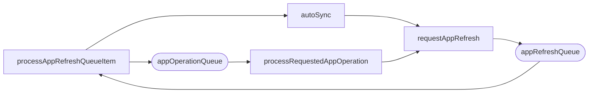

# 7. Fan-in, cycles, and cross-cutting concerns

## Shared-helper fan-in

Blast radius when you change one of these:

| Function | Called from | Sites |
|---|---|---|
| `getAppProj` | `handleObjectUpdated`, `getResourceTree`, `refreshAppConditions`, `updateFinalizers`, `finalizeApplicationDeletion`, `processRequestedAppOperation`, `NamespaceIndex` indexer, `orphanedIndex` indexer, `RegisterClusterSecretUpdater` (as value) | 9 |
| `canProcessApp` | `readinessHealthCheck`, `handleObjectUpdated`, informer `AddFunc` / `UpdateFunc` / `DeleteFunc`, metrics server (as value) | 6 |
| `requestAppRefresh` | `handleObjectUpdated`, informer `UpdateFunc`, `processAppComparisonTypeQueueItem`, `processRequestedAppOperation` (2×), `autoSync` | 6 |
| `setOperationState` | `processRequestedAppOperation` only, but 5 call sites including the panic-recover defer | 5 |
| `isAppNamespaceAllowed` | `canProcessApp`, `getAppList`, `ListFunc`, `NamespaceIndex`, `orphanedIndex` | 5 |
| `logAppEvent` | `processAppOperationQueueItem`, `setOperationState`, `persistAppStatus` (2×), `autoSync` | 5 |
| `updateFinalizers` | `finalizeApplicationDeletion` (4×), `processAppRefreshQueueItem` | 5 |
| `toAppKey` | `requestAppRefresh`, `handleObjectUpdated`, `getResourceTree`, `processRequestedAppOperation` | 4 |
| `PatchAppWithWriteBack` | `setOperationState`, `normalizeApplication`, `persistAppStatus` | 3 |
| `setAppCondition` | `processAppOperationQueueItem`, `NamespaceIndex` indexer (2×) | 3 |
| `getPermittedAppLiveObjects` | `finalizeApplicationDeletion` (3×) | 3 |
| `writeBackToInformer` | `PatchAppWithWriteBack`, `autoSync` | 2 |
| `getResourceTree` | `setAppManagedResources`, `processAppRefreshQueueItem` (fast path) | 2 |
| `isSelfReferencedApp` | `handleObjectUpdated`, `shouldBeDeleted` | 2 |
| `projectErrorToCondition` | `refreshAppConditions`, `NamespaceIndex` indexer | 2 |

## Cycles

Two exist. Both are mediated by a work queue rather than being direct recursion, so
neither can blow the stack — but both can spin if the exit condition breaks.

1. **Self-heal rescheduling** — `processAppRefreshQueueItem` → `autoSync` →
   `requestAppRefresh` → `appRefreshQueue`. Exit condition is
   `selfHealRemainingBackoff` eventually returning ≤ 0.
2. **Post-sync refresh** — `processAppRefreshQueueItem` → `appOperationQueue` →
   `processRequestedAppOperation` → `requestAppRefresh` → `appRefreshQueue`. Exit
   condition is `needRefreshAppStatus` returning false once the status is current.

`alreadyAttemptedSync` is the guard that stops a third, worse cycle: an app that
stays `OutOfSync` after a successful apply (for example auto-sync with pruning
disabled) would otherwise be synced forever.

`getAppProj` ⇄ `appProjCache.GetAppProject` is a genuine two-way reference rather
than a call cycle — the cache entry holds a back-pointer to `ctrl` so a miss can
reach `projInformer` and `db`.

## Cross-cutting concerns

### Sharding

`canProcessApp` gates every informer handler and `handleObjectUpdated`. Order of
checks:

1. `isAppNamespaceAllowed` — control-plane namespace, or glob/regexp match against
   `applicationNamespaces`
2. `argocd.argoproj.io/skip-reconcile` annotation
3. `clusterSharding.IsManagedCluster(destCluster)`

If the destination cannot be resolved it calls `IsManagedCluster(nil)`, so
unresolvable apps land on a deterministic shard instead of being dropped by every
replica.

### Informer staleness

Three separate mitigations, which signals this was a real source of bugs:

| Mitigation | Where |
|---|---|
| Patch always paired with informer write-back | `PatchAppWithWriteBack` |
| Re-GET from API server before acting on an operation | `processAppOperationQueueItem`, `finalizeApplicationDeletion`, `processRequestedAppOperation` |
| `ErrAnotherOperationInProgress` treated as benign | `autoSync` |

### Panic isolation

All six workers have `defer recover()` logging the stack.
`processRequestedAppOperation` goes further and converts a panic into
`OperationError` with the panic message, so a crash cannot leave an app stuck in
`Running` forever.

### Namespace key formats

Three representations circulate and are converted constantly:

| Format | Produced by | Used for |
|---|---|---|
| `ns/name` | `cache.MetaNamespaceKeyFunc`, `toAppKey`, `toAppQualifiedName` | informer indexer keys, queue keys |
| `ns_name` | `app.InstanceName(ctrl.namespace)` | redis cache keys |
| qualified | `app.QualifiedName()` | `requestAppRefresh`, log fields |

`toAppKey` normalizes all three: it prepends the controller namespace to an
unqualified name, passes through anything already containing `/`, and converts `_`
to `/`.

### Multi-source branching

`app.Spec.HasMultipleSources()` is checked in `processAppRefreshQueueItem`,
`autoSync`, `alreadyAttemptedSync`, and `currentSourceEqualsSyncedSource`. When
multiple sources exist, `spec.source` is ignored entirely in favor of
`spec.sources`.

### Observability

Every significant function builds a `stats.NewTimingStats()` and dumps all
checkpoints into a single log line via a deferred closure. That is where the
`time_ms`, `patch_ms`, `setop_ms`, and per-phase `*_ms` fields in
"Reconciliation completed" come from. `appComparisonTypeRefreshQueue` is the only
queue created without a `Name`, so it does not appear in workqueue metrics.
