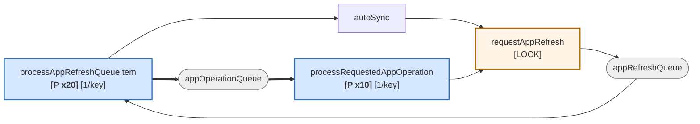

# 7. Fan-in, cycles, and cross-cutting concerns

## Goroutine classes in this file

Every row below is a distinct concurrency context. Nine of them, and any shared
helper reached from more than one has to be safe under all of them.

| Class | Count | Driven by |
|---|---|---|
| refresh worker | `statusProcessors`, default **20** | `appRefreshQueue` |
| operation worker | `operationProcessors`, default **10** | `appOperationQueue` |
| comparison-type worker | **1** | `appComparisonTypeRefreshQueue` |
| project worker | **1** | `projectRefreshQueue` |
| hydrate worker | **1**, only if `hydrator != nil` | `appHydrateQueue` |
| hydration worker | **1**, only if `hydrator != nil` | `hydrationQueue` |
| appInformer handler listener | **1** | client-go; `AddFunc`/`UpdateFunc`/`DeleteFunc` share it |
| projInformer handler listener | **1** | client-go; all three of its handlers share it |
| informer `HandleDeltas` | **1 per informer** | client-go; runs the indexers |
| cluster watch | **1 per managed cluster** | gitops-engine; calls `handleObjectUpdated` |
| HTTP handler | unbounded | metrics server; `readinessHealthCheck` |
| startup | **1** | `NewApplicationController` + `Run` up to `WaitForCacheSync` |

## Shared-helper fan-in

Blast radius when you change one of these. The third column is the one that matters
for correctness — a helper reached from several classes cannot assume anything about
its caller.

| Function | Called from | Sites | Goroutine classes |
|---|---|---|---|
| `getAppProj` | `handleObjectUpdated`, `getResourceTree`, `refreshAppConditions`, `updateFinalizers`, `finalizeApplicationDeletion`, `processRequestedAppOperation`, `NamespaceIndex` indexer, `orphanedIndex` indexer, `RegisterClusterSecretUpdater` (as value) | 9 | **5** — refresh, operation, cluster watch, HandleDeltas, cluster-info updater `[LOCK]` |
| `canProcessApp` | `readinessHealthCheck`, `handleObjectUpdated`, informer `AddFunc` / `UpdateFunc` / `DeleteFunc`, metrics server (as value) | 6 | **3** — HTTP, cluster watch, appInformer listener |
| `requestAppRefresh` | `handleObjectUpdated`, informer `UpdateFunc`, `processAppComparisonTypeQueueItem`, `processRequestedAppOperation` (2x), `autoSync` | 6 | **5** — cluster watch, appInformer listener, comparison-type, operation, refresh `[LOCK]` |
| `setOperationState` | `processRequestedAppOperation` only, but 5 call sites including the panic-recover defer | 5 | **1** — operation |
| `isAppNamespaceAllowed` | `canProcessApp`, `getAppList`, `ListFunc`, `NamespaceIndex`, `orphanedIndex` | 5 | **4** — inherits `canProcessApp`'s, plus reflector, HandleDeltas, startup |
| `logAppEvent` | `processAppOperationQueueItem`, `setOperationState`, `persistAppStatus` (2x), `autoSync` | 5 | **2** — refresh, operation |
| `updateFinalizers` | `finalizeApplicationDeletion` (4x), `processAppRefreshQueueItem` | 5 | **2** — refresh, operation |
| `toAppKey` | `requestAppRefresh`, `handleObjectUpdated`, `getResourceTree`, `processRequestedAppOperation` | 4 | **4** — pure function, so this is harmless |
| `PatchAppWithWriteBack` | `setOperationState`, `normalizeApplication`, `persistAppStatus` | 3 | **2** — refresh, operation |
| `setAppCondition` | `processAppOperationQueueItem`, `NamespaceIndex` indexer (2x) | 3 | **2** — operation, HandleDeltas |
| `getPermittedAppLiveObjects` | `finalizeApplicationDeletion` (3x) | 3 | **1** — operation |
| `writeBackToInformer` | `PatchAppWithWriteBack`, `autoSync` | 2 | **2** — refresh, operation |
| `getResourceTree` | `setAppManagedResources`, `processAppRefreshQueueItem` (fast path) | 2 | **1** — refresh |
| `isSelfReferencedApp` | `handleObjectUpdated`, `shouldBeDeleted` | 2 | **2** — cluster watch, operation |
| `projectErrorToCondition` | `refreshAppConditions`, `NamespaceIndex` indexer | 2 | **2** — refresh, HandleDeltas |

Two rows are worth pausing on. `requestAppRefresh` and `getAppProj` are each reached
from five classes, which is exactly why they are the only two helpers in the file
that take a lock. Everything else is either single-class, pure, or writes only
through the API server.

`setAppCondition` is the quiet one: it is reached from the operation worker *and*
from `HandleDeltas`, so a condition can be written by an indexer with no reconcile
anywhere in the logs to account for it.

## Cycles

Two exist. Both are mediated by a work queue rather than being direct recursion, so
neither can blow the stack — and because the queue hop crosses goroutines, neither
one is even a nested call.

1. **Self-heal rescheduling** — `processAppRefreshQueueItem` → `autoSync` →
   `requestAppRefresh` → `appRefreshQueue`. Stays within the refresh worker class,
   though not necessarily the same goroutine: the re-queued key can be picked up by
   any of the 20. Exit condition is `selfHealRemainingBackoff` eventually returning
   ≤ 0, and because `SelfHealAttemptsCount` is carried in the Application rather
   than in worker memory, the count survives the goroutine change.
2. **Post-sync refresh** — `processAppRefreshQueueItem` → `appOperationQueue` →
   `processRequestedAppOperation` → `requestAppRefresh` → `appRefreshQueue`. Crosses
   from the refresh class to the operation class and back. Exit condition is
   `needRefreshAppStatus` returning false once the status is current.

`alreadyAttemptedSync` is the guard that stops a third, worse cycle: an app that
stays `OutOfSync` after a successful apply (for example auto-sync with pruning
disabled) would otherwise be synced forever.

`getAppProj` ⇄ `appProjCache.GetAppProject` is a genuine two-way reference rather
than a call cycle — the cache entry holds a back-pointer to `ctrl` so a miss can
reach `projInformer` and `db`.

## Cross-cutting concerns

### Serialization primitives

The complete list. Three locks and one semaphore, and only two of the four are
contended in normal operation.

| Primitive | Protects | Held across I/O | Contended by |
|---|---|---|---|
| `refreshRequestedAppsMutex` (`sync.Mutex`) | `refreshRequestedApps` map | no | 5 goroutine classes, but the section is one map operation |
| `projByNameCache` (`sync.Map`) | project cache entries | n/a | lock-free reads |
| `appProjCache.lock` (`sync.Mutex`, one per project) | that entry's `appProj` | **yes** — `projInformer` + `db` | refresh workers reconciling apps in the same project |
| `kubectlSemaphore` (`semaphore.Weighted`, default 20) | fork/exec count | **yes** — the whole exec | all 10 operation workers, plus post-delete hooks |

`appProjCache.lock` holding across a fetch is intentional: on a cold cache, workers
wanting the same project queue behind one fetch instead of stampeding the API
server. `kubectlSemaphore.Acquire` uses `context.Background()`, so that wait is
uncancellable and does not appear in any timing checkpoint.

### Sharding

`canProcessApp` gates every informer handler and `handleObjectUpdated`, so it is
called from three goroutine classes and must be safe under all of them. Order of
checks:

1. `isAppNamespaceAllowed` — control-plane namespace, or glob/regexp match against
   `applicationNamespaces`
2. `argocd.argoproj.io/skip-reconcile` annotation
3. `clusterSharding.IsManagedCluster(destCluster)`

If the destination cannot be resolved it calls `IsManagedCluster(nil)`, so
unresolvable apps land on a deterministic shard instead of being dropped by every
replica.

### Informer staleness

Three separate mitigations, which signals this was a real source of bugs. All three
exist because per-key queue serialization is **per queue**, so a refresh worker and
an operation worker can hold the same app at once:

| Mitigation | Where |
|---|---|
| Patch always paired with informer write-back | `PatchAppWithWriteBack` |
| Re-GET from API server before acting | `processAppOperationQueueItem`, `finalizeApplicationDeletion`, `processRequestedAppOperation` |
| `ErrAnotherOperationInProgress` treated as benign | `autoSync` |

### Panic isolation

All six workers have `defer recover()` logging the stack, which is what keeps one
app's panic from killing a shared goroutine — without it, a panic in a singleton
worker would take out that entire loop until `wait.Until` restarted it a second
later. `processRequestedAppOperation` goes further and converts a panic into
`OperationError` with the panic message, so a crash cannot leave an app stuck in
`Running` forever.

### Namespace key formats

Three representations circulate and are converted constantly:

| Format | Produced by | Used for |
|---|---|---|
| `ns/name` | `cache.MetaNamespaceKeyFunc`, `toAppKey`, `toAppQualifiedName` | informer indexer keys, queue keys |
| `ns_name` | `app.InstanceName(ctrl.namespace)` | redis cache keys |
| qualified | `app.QualifiedName()` | `requestAppRefresh`, log fields |

`toAppKey` normalizes all three: it prepends the controller namespace to an
unqualified name, passes through anything already containing `/`, and converts `_`
to `/`. It is pure, which is why it is safe at 4 call sites across 4 goroutine
classes with no lock.

Getting this wrong is a concurrency bug, not just a lookup miss: the workqueue's
one-in-flight-per-key guarantee is keyed on the exact string. Two spellings of the
same app are two keys, and the guarantee silently stops applying.

### Multi-source branching

`app.Spec.HasMultipleSources()` is checked in `processAppRefreshQueueItem`,
`autoSync`, `alreadyAttemptedSync`, and `currentSourceEqualsSyncedSource`. When
multiple sources exist, `spec.source` is ignored entirely in favor of
`spec.sources`.

### Observability

Every significant function builds a `stats.NewTimingStats()` and dumps all
checkpoints into a single log line via a deferred closure. That is where the
`time_ms`, `patch_ms`, `setop_ms`, and per-phase `*_ms` fields in
"Reconciliation completed" come from.

Two gaps worth knowing when you are diagnosing throughput rather than latency:

- `appComparisonTypeRefreshQueue` is the only queue created without a `Name`, so it
  does not appear in workqueue metrics at all.
- Time spent waiting on `kubectlSemaphore` is inside `SyncAppState` and is not
  broken out by any checkpoint, so semaphore starvation looks like a slow sync.

Queue depth and latency for the other five queues *are* exported, and comparing
`appRefreshQueue` depth against 20 workers is the fastest way to tell whether the
controller is under-provisioned or just slow.
